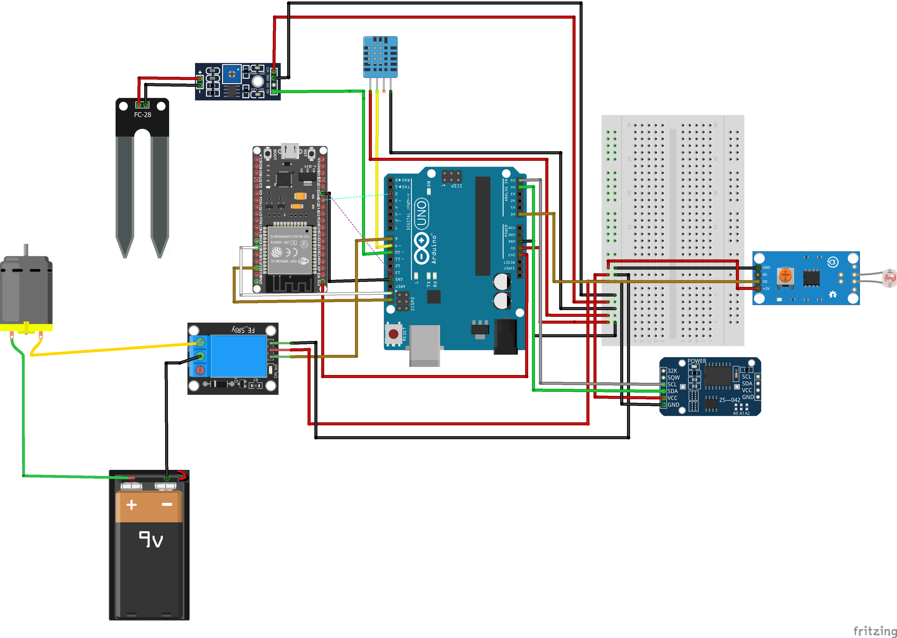
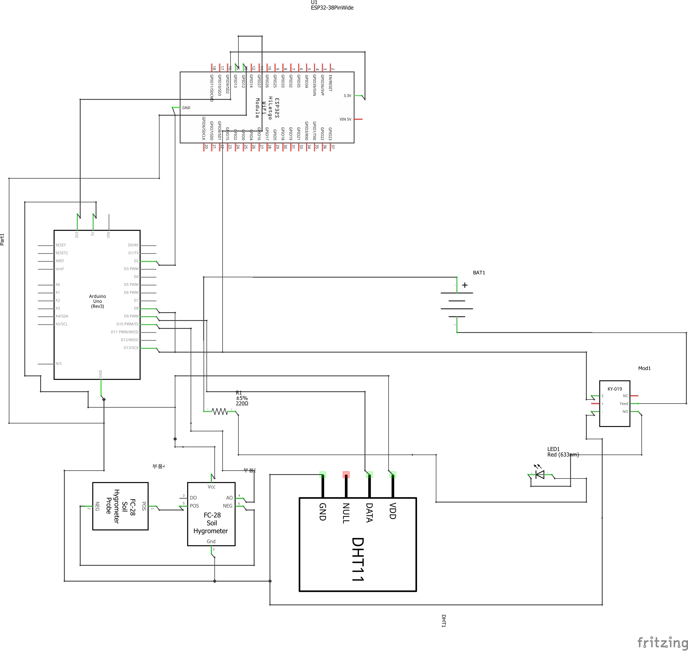

# Sistem Penyiraman Otomatis Berbasis Mikrokontroller
Ini adalah projek Mata Kuliah Sistem Mikroprosessor.
Sistem Penyiraman akan otomatis menyala jika memenuhi kondisi pada cuaca, cahaya ataupun kelembaban tanah

## Komponen
<ol type="1">
  <li>DS3231</li>
  <li>Arduino Uno</li>
  <li>ESP32</li>
  <li>DHT11</li>
  <li>Soil Moisture Sensor</li>
  <li>Pompa Air</li>
  <li>Relay Module</li>
  <li>Baterai 18650 x4</li>
  <li>LDR</li>
</ol>

## Cara Kerja
<ol type="1">
  <li>Arduino akan membaca data dari Komponen DHT, Soil Moisture, LDR atau DS3231 (Note: untuk sekarang hanya membaca DHT, dan Soil Moisture)</li>
  <li>Jika Data dari Komponen memenuhi kondisi yang di tentukan maka Pompa Air akan menyala</li>
  <li>Lalu Arduino akan melakukan UART(Universal Asynchronous Receiver/Transmitter) ke ESP32</li>
  <li>Dan ESP32 akan mengirim data Status ke Server lalu ke Database (Disini saya menggunakan Laptop sebagai server)</li>
</ol>

## Rangkaian

## Schematic

